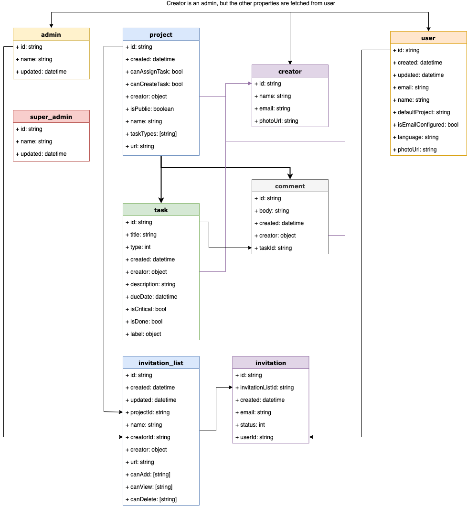

[](https://circleci.com/gh/Metaburn/doocrate)

# Doocrate

You can read more about it in https://website.doocrate.com/

Try the demo at https://staging.doocrate.com
A task management system which allows user to self assign themself
So normally you don't have permission unless you create a task or
assign yourself to a task.
This allows organization to manage tasks in a TEAL way

## Documentation

https://docs.doocrate.com/

## Stack

- React, Redux, Thunk, React Router, Node
- Firebase Firestore

## Needed

Node v10.19.0

## Quick Start

#### Install

```
source ./intall.sh
```

or

```shell
git clone https://github.com/metaburn/doocrate.git
cd doocrate
nvm use
yarn
cd functions
npm install
cd ..
yarn run copy-staging
yarn global add firebase-tools
```

#### Run Locally

```
yarn run
```

## Deploy command

`yarn run deploy:staging`
OR
`yarn run deploy:production`
Will build - use the correct config file and deploy

#### Staging

You can also set staging env and use:
`firebase use --add` to add your staging site
Then run like
`yarn run build-staging`
`firebase use staging`
`yarn run deploy:staging`

#### Build and deploy the app:

```shell
cd functions
npm install
cd ..
yarn
firebase login
firebase use default
yarn run deploy:production
// And if you want only to deploy without building you can run firebase deploy
```

## Deploy only server functions

You can use the following to deploy faster

```
yarn deploy:staging-only-server
```

## Setting up your own server

Only If you are interested in setting up your own server (That is your own doocrate.com on a different domain)- read [Setting Up your own server](./docs/setting_your_own_server.md)

## Translations

You can find translations under `public/locales/`

You can open the page with the required language. For example use
`http://localhost:3000/sign-in/?lng=he` to open the hebrew version
`http://localhost:3000/sign-in/?lng=en` to open the english version

## Firestore rules

Rules are a way to restrict access to the database and give different users different permissions
For example - Anyone can create a task. But only a task creator (And assignee)can edit a task

Whenever you publish the project the `firestore.rules` page would get updated
Then hit `Publish` to save it

## Creating index

After the system is up:
Create a new task And also create a new comment.
If you open the console you would get a link with something like:

```
database.js:944 Uncaught Error in onSnapshot: Error: The query requires an index. You can create it here: https://console.firebase.google.com/project/doocrate-2018/database/firestore/indexes?create_index=Eghjb21tZW50cxoKCgZ0YXNrSWQQAhoLCgdjcmVhdGVkEAIaDAoIX19uYW1lX18QAg
```

Click that link to create the indexing for it

## Labels Colors

Create a collection named
`labels`
In order to create labels colors you need to create a collection called 'labels' with documents like so:
Set for `Document Id` - The actual tag name - for example - "art"
Then inside have a field "name" with value "art" and another field "colorInHex" with color value. For example "EB1478" - This will color all label of type "art" with color "EB1478"

# Schema



To update the schema, you can load the [Schema.xml](./docs/firestore_schema.xml) file into [draw.io](https://draw.io)
[Docs](/docs)

# Labels

Under `src/config/app-config` you have the popular labels that would appear when someone creates a task

## Backup

Downloag gcloud:
https://cloud.google.com/sdk/docs/downloads-versioned-archives

To backup you first need to create a new multi regional bucket - for example - doocrate-new-backups

Then, Run the following command to backup -
`gcloud alpha firestore export gs://doocrate-new-backups`

## Restore from backup

Import all by calling `gcloud alpha firestore import gs://[BUCKET_NAME]/[EXPORT_PREFIX]/` where `[BUCKET_NAME]` and `[EXPORT_PREFIX]`
point to the location of your export files. For example - `gcloud alpha firestore import gs://exports-bucket/2017-05-25T23:54:39_76544/`

Import a specific collection by calling: `gcloud alpha firestore import --collection-ids='[COLLECTION_ID_1]','[COLLECTION_ID_2]' gs://[BUCKET_NAME]/[EXPORT_PREFIX]/`

# Stop the system

You can user the `/admin/dashboard` page if you are an admin to set permissions
You can press on the button their - This would go over all the users in the system and would set the
"canCreateTask, "canAssignTask" permissions which allows to create new tasks and assign / unassign themself

## YARN Commands

| Script                       | Description                                         |
| ---------------------------- | --------------------------------------------------- |
| `yarn start`                 | Start webpack development server @ `localhost:3000` |
| `yarn backup`                | Backup to a local database                          |
| `yarn run deploy:staging`    | Build and deploy to staging                         |
| `yarn run deploy:production` | Build and deploy to production                      |
| `yarn run build`             | Build the application to `./build` directory        |
| `yarn test`                  | Test the application; watch for changes and retest  |

## FAQ

#### What are projects

User is the root for a task. Each task exists within a project

#### What are Admins

Admins can edit any task under a project.
Once a user creates a new project he is added into the `admins`
`admins`->`user id`->`projects`->`project id`
This helps us know which admin belongs to which projects

#### What are Super Admins

Super Admins can edit any task under ANY project.
These are root level admins.
They are defined manually in the collection super_admins -> UID

#### Why is Mail is not being sent?

Check that you are on the `blaze` (Pay as you go) plan.
Otherwise external services such as mailgun aren't accessible. Don't worry.
Firebase won't charge money unless you have > 10000 users from our calculations

Also, Check that all the settings are correct and you have created a mailgun
username and set up the domain correctly

#### Is there a reports page

Yes `/:project-id/reports`

#### Is there a super admin page

Yes. `/admin-dashboard`

#### I'm getting this error:

```Uncaught DOMException: Failed to execute 'setRequestHeader' on 'XMLHttpRequest': 'projects/doocrate-production
                 /databases/(default)' is not a valid HTTP header field value.
```

1.Make sure you set up Firestore database by activating it in firebase console

2.Make sure that your config doesnt have a wrong char such as \n in the end:
`projectId: 'doocrate-production\n',

#### Where is the backend?

Located under the `functions` folder (This is firebase standard)

#### How can I deploy in a fast way

If you haven't modified the functions folder you can run the following to deploy only the app without the functions:
`yarn run build && firebase deploy --only=hosting`

#### Why am I seeing the loader runs and runs on a new install

Only when there is at least one task it would stop running - Press on add task

#### Is there a way to close the system on the frontend side

Yes - under `src->config->app-config` set the parameter `isSystemClosed` to true

#### Is there a way to open / close new users from openning / assigning tasks

Yes - Each project now has ability to set it under edit project page

#### Comments are not working

Check you console. You need to follow the error using the link and create an index for comments

#### Can I deploy only the hosting without the functions?

Yes run

```
yarn run build
firebase deploy --hosting
```

#### User redirection

Yes done through a cookie `is_redirected` and a url for example `?project=adacontra-2019`

#### I'm having issue running npm install

Make sure you use the correct node by running:
`nvm use`

#### Do you have any unit tests?

Yes we do. We also have firestore rules unit tests `yarn run test:firestore-rules`
